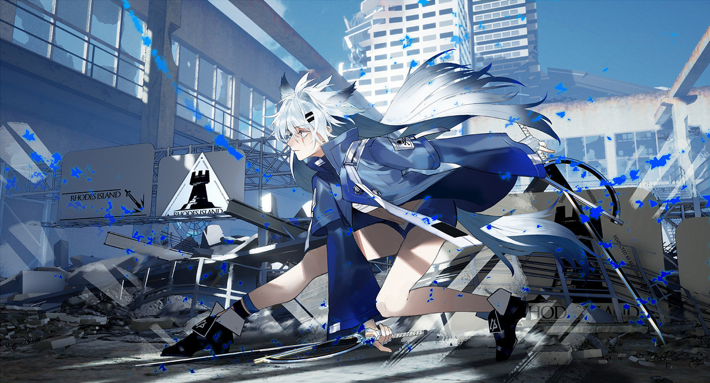

# ArkOS

Client part of Arknights-Operator-System.

    <a href="https://www.pixiv.net/en/artworks/75499774">@佑野. <i>Lappland</i>. July 1st 2019. Pixiv</a>

 

    
## Acknowledgement

- The *ADB connecting module* and *stage_ocr module* are borrowed from [@ninthDevilHAUNSTER](https://github.com/ninthDevilHAUNSTER) repo : [ArknightsAutoHelper](https://github.com/ninthDevilHAUNSTER/ArknightsAutoHelper)

- This project was created with the help of my friends:
  - [@qxdn](https://github.com/qxdn)
  - [@zyh802](https://github.com/zyh802)

